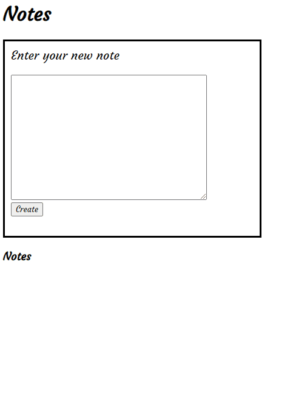

#Notes

##Single page application in pure Javascript

 

Application</img>
 

Fully crafted testing suite</img>

<h3>Objectives</h3>

- Writing a front-end, single page app using only pure Javascript
- Implementing functionality dependent upon asynchronous behaviour in Javascript
- Create and utilizing a test driven framework in pure Javascript

<h3>Technology used</h3>
- Javascript
- HTTP-Server

<h3>Run tests</h3>
- Open `Specrunnel.html` in browser.
- Inspect page to view console logs for more information

<h3>Run application</h3>
- Execute command `npm install` in the command-line
- From root of the project execute command `http-server` in the command line
- Enjoy!
